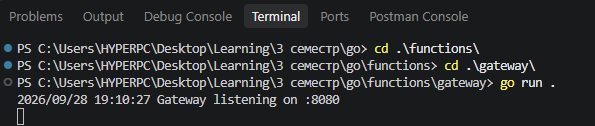
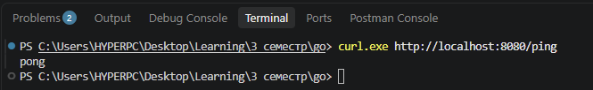
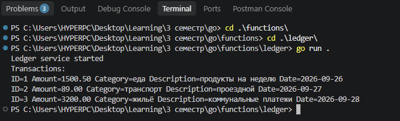

# Домашнее задание 2

Проект состоит из двух отдельных Go-модулей.

## Gateway

HTTP-шлюз. `GET /ping` отвечает `pong` со статусом 200.

```powershell
cd functions/gateway
go run .
```

Прослушиватель `http://localhost:8080`.



Проверка:

```powershell
curl.exe http://localhost:8080/ping
```

Ожидаемый ответ: `pong`.



## Ledger

Бизнес-логика (финансовые транзакции).

```powershell
cd functions/ledger
go run .
```


